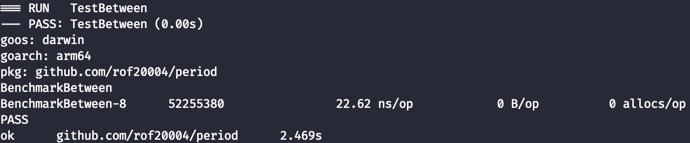

# Period

This package is a port from Java Time::Period class: https://docs.oracle.com/javase/8/docs/api/java/time/Period.html

This project is trying to abstract and offers a way to work with date/time in Go programming language based on the Java programming language

## Code

The code is near identical of Period class source code, I didn't change it too much, maybe a few things to achieve compatibility, like primitives types

## How to use

- Tested on Go version 1.19

```shell
go get -u github.com/rof20004/period
```

```go
package main

import (
	"fmt"
	"time"

	"github.com/rof20004/period"
)

func main() {
	birthDate := time.Date(1984, time.March, 4, 0, 0, 0, 0, &time.Location{})

	p := period.Between(birthDate, time.Now())

	fmt.Printf("You have %d years, %d months e %d days\n", p.Years, p.Months, p.Days)
}
```

## Test

```shell
go test -v --bench . --benchmem
```

